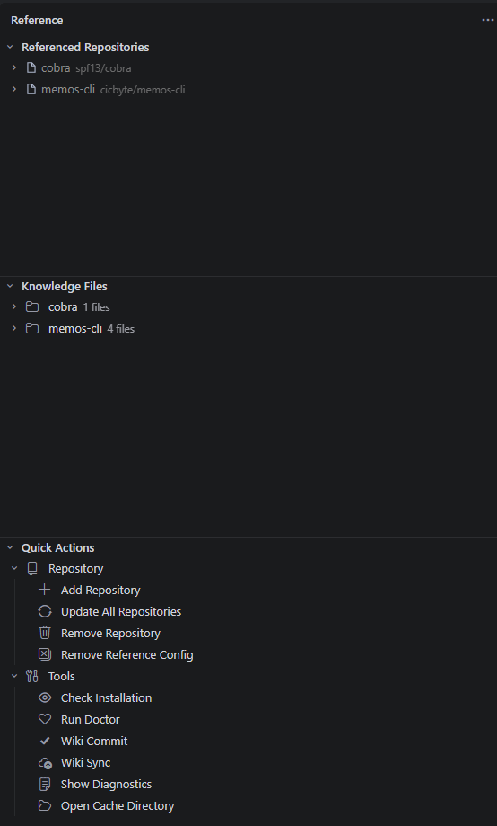
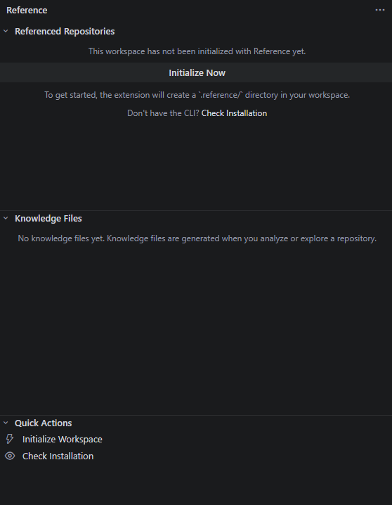

# Reference - VS Code Extension

**[English](README.en.md) | 中文**

> 在 VS Code 中可视化管理代码仓库引用与知识文件，为 AI 编程助手提供零延迟的可复用代码知识库。

[](LICENSE)
[](https://code.visualstudio.com/)



## 功能特性

- **多 AI 助手集成** — 初始化时多选注入 AI 助手配置（Claude Code、Codex、OpenCode、ZCode、MiMo Code），自动生成子代理与 Skill
- **仓库引用管理** — 通过图形界面添加（远程/本地）、更新、移除 Git 仓库引用，无需终端操作
- **源码目录浏览** — 侧栏树形视图直接浏览引用仓库的目录结构，点击文件即可打开
- **知识文件管理** — 按仓库分组展示 `.reference/wiki/` 下的 Markdown 知识文件；提交/同步时可选远程知识库或本地知识库（localwiki）
- **代码统计** — Webview 展示语言分布、代码行数、复杂度和 Top 文件排名
- **健康诊断** — 单项目诊断（结构化检查表 Webview）与跨项目全局体检（并发扫描，快速定位失效引用）
- **全局管理** — 所有项目总览（引用数、失效项目、助手配置）；清理过期记录与孤立缓存；跨项目移除引用
- **状态栏集成** — 底部状态栏实时显示引用仓库数量和同步状态
- **自动刷新** — 监听 `.reference/` 目录变化，TreeView 自动更新
- **工作区初始化引导** — 未初始化时自动引导，已初始化工作区支持复用或重选助手

## 前置依赖

本插件是 [reference](https://github.com/cicbyte/reference) CLI 工具的图形化前端，**不包含任何业务逻辑**。使用前需安装 `reference` 二进制（**v0.0.8+**，多 AI 助手与 localwiki 等功能依赖该版本）：

```bash
# Go install
go install github.com/cicbyte/reference@latest

# 或手动下载 binary 加入 PATH
```

安装后验证：

```bash
reference version
```

## 安装

### 从 VSIX 安装

```bash
# 下载 .vsix 文件后
code --install-extension reference-vscode-plugin-0.1.0.vsix
```

### 从源码构建

```bash
git clone https://github.com/cicbyte/reference-vscode-plugin.git
cd reference-vscode-plugin
npm install
npm run build
# F5 启动扩展调试
```

## 使用方法

### 初始化

首次在项目中使用时，点击侧栏 Reference 图标，点击 **Initialize Now**。在弹出的多选列表中选择要注入的 AI 助手（Claude Code、Codex、OpenCode、ZCode、MiMo Code），可多选；也可不选（仅使用仓库引用管理）。已初始化的工作区再次执行时会提示复用当前助手或重新选择。



### 添加仓库

通过侧栏 **+** 按钮或命令面板 `Reference: Add Repository`：

- **远程仓库** — 输入 Git URL（如 `github.com/gin-gonic/gin`），可选指定分支；默认拉取最新缓存
- **本地仓库** — 选择本地 Git 仓库路径，输入引用名

### 管理引用

| 操作 | 入口 |
|------|------|
| 更新单个仓库 | 右键仓库节点 → 同步图标 |
| 移除仓库 | 右键仓库节点 → 垃圾桶图标 |
| 移除全部 | Quick Actions → Remove All Repositories |
| 查看代码统计 | 右键仓库 → Show Code Statistics |
| 打开仓库目录 | 右键仓库 → Open Repository Folder |

### 浏览知识文件

切换到 **Knowledge Files** 面板，按仓库分组查看 `.md` 知识文件，点击直接在编辑器中打开。

### 命令面板

所有命令以 `Reference:` 为前缀，通过 `Ctrl+Shift+P` 访问：

| 命令 | 说明 |
|------|------|
| `Reference: Add Repository` | 添加远程或本地仓库（远程默认拉取最新缓存） |
| `Reference: Remove Repository` | 移除单个仓库 |
| `Reference: Remove All Repositories` | 移除全部仓库（可选清理 .reference/） |
| `Reference: Update Repository` | 更新单个仓库缓存 |
| `Reference: Initialize Workspace` | 初始化工作区，多选注入 AI 助手 |
| `Reference: Show Code Statistics` | 代码统计 Webview |
| `Reference: Run Doctor` | 单项目诊断（结构化检查表 Webview） |
| `Reference: Global Health Check` | 跨项目并发体检，定位失效引用 |
| `Reference: Show All Projects` | 全局项目总览 Webview（引用数、助手、失效项） |
| `Reference: Remove Global Reference` | 跨项目移除指定仓库引用 |
| `Reference: Clean Up Unused References & Cache` | 清理过期记录与孤立缓存（dry-run 预览 + 确认） |
| `Reference: Wiki Commit` | 提交知识库变更（可选远程 / 本地 / 两者） |
| `Reference: Wiki Sync` | 同步知识库（pull + commit + push） |
| `Reference: Check CLI Installation` | 检测 CLI 安装状态 |
| `Reference: Show Diagnostics & Logs` | 打开输出通道查看日志 |

## 配置

在 VS Code 设置中搜索 `reference`：

| 配置项 | 类型 | 默认值 | 说明 |
|--------|------|--------|------|
| `reference.binaryPath` | string | `""` | reference 二进制绝对路径，留空自动从 PATH 检测 |
| `reference.autoRefresh` | boolean | `true` | .reference/ 目录变化时自动刷新视图 |

## 架构

```
src/
├── extension.ts           # 扩展入口
├── types.ts               # 类型定义
├── services/
│   ├── binaryManager.ts   # 二进制查找、版本校验
│   ├── cli.ts             # CLI 命令封装（execFile + JSON/文本解析）
│   └── workspaceManager.ts # .reference/ 目录管理 + 文件监听
└── ui/
    ├── treeView.ts         # TreeDataProvider（仓库/知识/快捷操作）
    ├── statusBar.ts        # 状态栏
    └── commands.ts         # 命令注册与实现
```

核心设计：插件通过 `child_process.execFile` 调用 `reference` 二进制，解析 `--format jsonl` 输出，不内嵌任何业务逻辑。

## 构建 & 开发

```bash
npm install          # 安装依赖
npm run watch        # 增量编译 + 监听
npm run build        # 生产构建（minify）
npm run lint         # TypeScript 类型检查
npm run package      # 打包 .vsix
```

调试：在 VS Code 中打开项目，按 **F5** 启动扩展宿主窗口。

## 开源许可证

[MIT](LICENSE)
